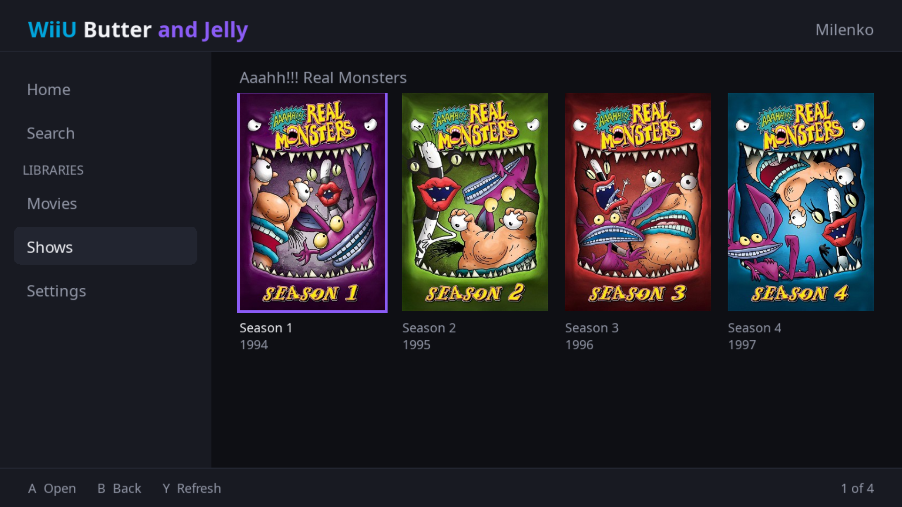
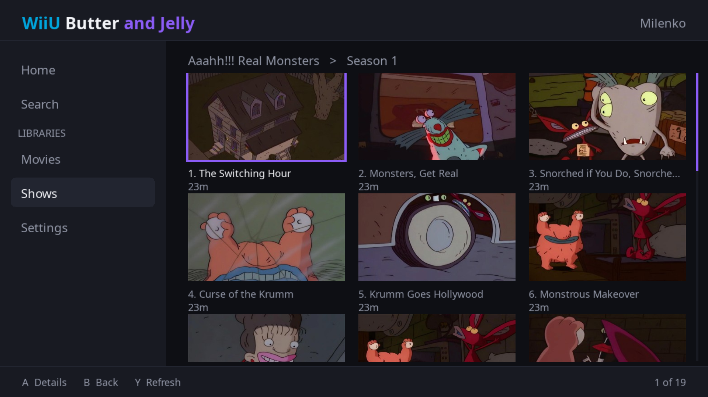
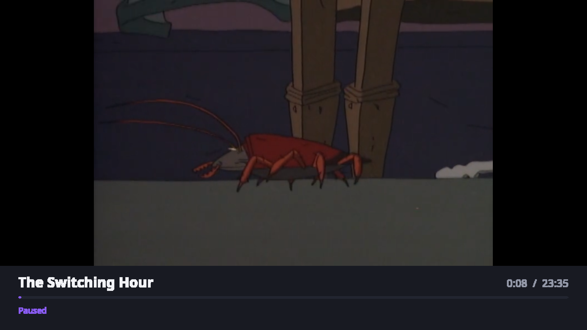
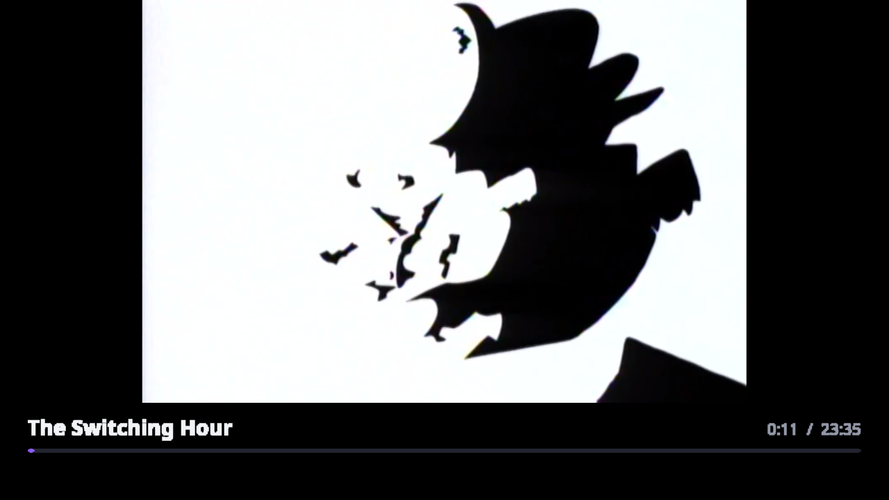
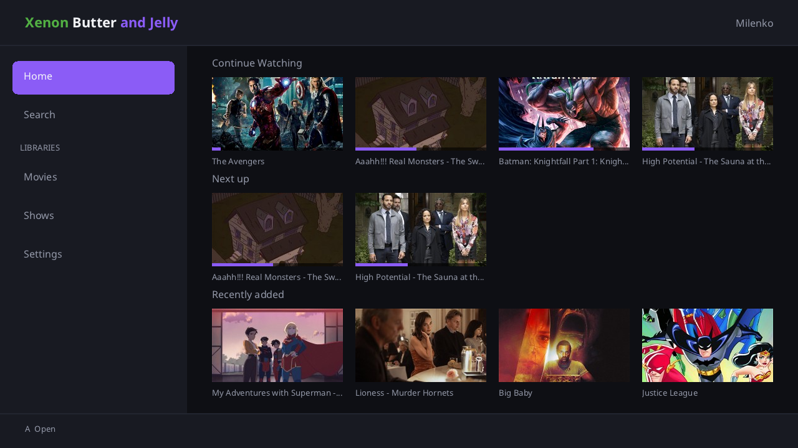
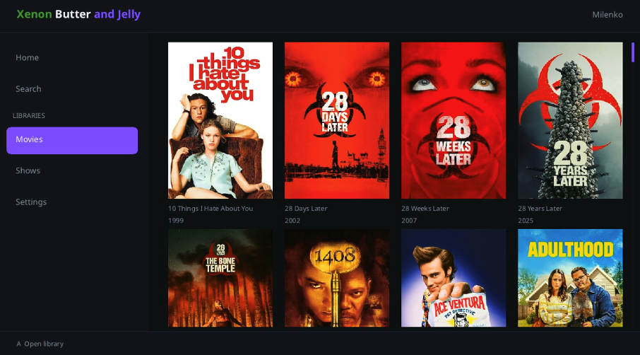

# Butter and Jelly

A Jellyfin client for the Wii U and Xbox 360.

**Wii U**

 
 

The last one is the GamePad, which mirrors playback and can take it on its own.

**Xbox 360**

 


All captured from the consoles, not from an emulator.

One codebase, two big endian PowerPC consoles. `src/core` and `src/ui` are
shared; `src/platform` holds what differs.

## What works

| | Wii U | Xbox 360 |
| --- | --- | --- |
| Browse libraries, search, resume | yes | yes |
| Quick Connect sign in | yes | yes |
| Video | up to 480p | up to 720p |
| Poster artwork | yes | yes |

## Getting it

One archive per console on the [releases page](../../releases), each with
install notes inside.

**Wii U.** Aroma. `butterandjelly.wuhb` to `sd:/wiiu/apps/`.

**Xbox 360.** A console that runs unsigned code. Copy `butterandjelly/` to the
hard disk and launch `default.xex`. It writes settings and cached posters
beside itself, so put it somewhere writable.

## Server and sign in

Discovery is by broadcast, which does not cross a subnet. If your server does
not appear, put `server.txt` beside the app or in its `data` folder, one server
per line:

```
http://192.168.1.10:8096
```

`http://` only. Sign in is Quick Connect, which must be enabled under
Dashboard, General, Quick Connect.

## Building

```sh
git clone --recursive https://github.com/MrMilenko/ButterAndJelly
cd ButterAndJelly
scripts/build.sh
```

[docs/building.md](docs/building.md) for per console requirements,
[docs/architecture.md](docs/architecture.md) for how it fits together.

## License

GPL-2.0-or-later, see [LICENSE](LICENSE) and
[docs/licensing.md](docs/licensing.md). Neither console's SDK is included.
